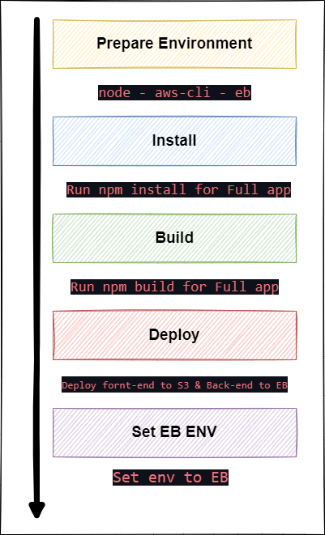

# Pipeline

Using pipeline to connect to githup repos

## Command

1. Using orbs to install :
    node: circleci/node@5.0.2
    aws-cli: circleci/aws-cli@2.1.0
    eb: circleci/aws-elastic-beanstalk@2.0.1
2. Check out the code using checkout Command
3. Install all dependences to fornt-end and back-end application
4. Build fron-end and back-end Application 
5. Deploy all app:
    fornt-end to aws-S3
    back-end to aws-EB
6. Set env variable to EB

## Diagram
